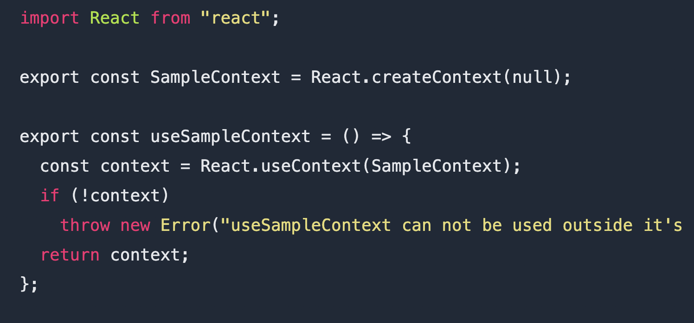

# rcvp README

A react pattern named Container/View is followed to achieve clean and readable code.

## Features

This will create a folder structure with boilerplate code.

Inside this file, whole your jsx part will come, all your designing and code.

Here, all your logic (js logic) will come.

## Requirements

react

## Extension Settings

How to enable
Hit CTRL + P
Type >rcvp
Enter name of your component
Hurahh!! 

**Enjoy!**
Cheers
Nikhil Kumar Gupta